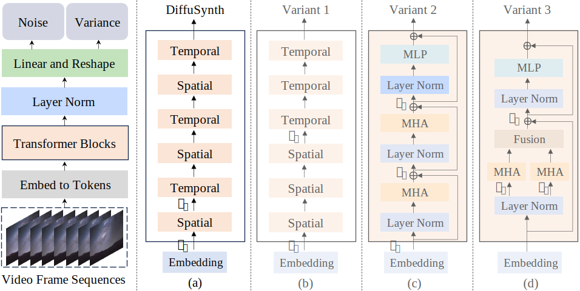

## Latte: Latent Diffusion Transformer for Video Generation<br><sub>Official PyTorch Implementation</sub>

<!-- ### [Paper](https://arxiv.org/abs/2401.03048v1) | [Project Page](https://maxin-cn.github.io/latte_project/) -->

<!-- [](https://arxiv.org/abs/2401.03048) -->
[](https://arxiv.org/abs/2401.03048) 
[](https://maxin-cn.github.io/latte_project/)
[](https://openbayes.com/console/public/tutorials/UOeU0ywVxl7) 

This repo contains PyTorch model definitions, pre-trained weights, and training/sampling code for our paper exploring 
latent diffusion models with transformers (Latte). You can find more visualizations on our [project page](https://maxin-cn.github.io/latte_project/).

> [**Latte: Latent Diffusion Transformer for Video Generation**](https://maxin-cn.github.io/latte_project/)<br>
> [Xin Ma](https://maxin-cn.github.io/), [Yaohui Wang*](https://wyhsirius.github.io/), [Xinyuan Chen](https://scholar.google.com/citations?user=3fWSC8YAAAAJ), [Gengyun Jia](https://scholar.google.com/citations?user=_04pkGgAAAAJ&hl=zh-CN), [Ziwei Liu](https://liuziwei7.github.io/), [Yuan-Fang Li](https://users.monash.edu/~yli/), [Cunjian Chen](https://cunjian.github.io/), [Yu Qiao](https://scholar.google.com.hk/citations?user=gFtI-8QAAAAJ&hl=zh-CN) (*Corresponding Author & Project Lead)
<!-- > <br>Monash University, Shanghai Artificial Intelligence Laboratory,<br> NJUPT, S-Lab, Nanyang Technological University 

We propose a novel Latent Diffusion Transformer, namely Latte, for video generation. Latte first extracts spatio-temporal tokens from input videos and then adopts a series of Transformer blocks to model video distribution in the latent space. In order to model a substantial number of tokens extracted from videos, four efficient variants are introduced from the perspective of decomposing the spatial and temporal dimensions of input videos. To improve the quality of generated videos, we determine the best practices of Latte through rigorous experimental analysis, including video clip patch embedding, model variants, timestep-class information injection, temporal positional embedding, and learning strategies. Our comprehensive evaluation demonstrates that Latte achieves state-of-the-art performance across four standard video generation datasets, i.e., FaceForensics, SkyTimelapse, UCF101, and Taichi-HD. In addition, we extend Latte to text-to-video generation (T2V) task, where Latte achieves comparable results compared to recent T2V models. We strongly believe that Latte provides valuable insights for future research on incorporating Transformers into diffusion models for video generation.

 {width=20}
 -->
 
<div align="center">
    
</div>


This repository contains:

* 🪐 A simple PyTorch [implementation](models/latte.py) of Latte
* ⚡️ **Pre-trained Latte models** trained on FaceForensics, SkyTimelapse, Taichi-HD and UCF101 (256x256). In addition, we provide a T2V checkpoint (512x512). All checkpoints can be found [here](https://huggingface.co/maxin-cn/Latte/tree/main). 

* 🛸 A Latte [training script](train.py) using PyTorch DDP.

## News
<!-- - (🔥 New) May. 2, 2024. 💥 The updated LatteT2V model is released. If you want to use the updated model to generate images directly, please make sure `video_length=1`, `enable_temporal_attentions=True` and `enable_vae_temporal_decoder=False` in [t2v_sample.yaml](configs/t2v/t2v_sample.yaml). -->

- (🔥 New) Mar. 20, 2024. 💥 An updated LatteT2V model is coming soon, stay tuned!
<div align="center">
    
</div>

- (🔥 New) Feb. 24, 2024. 💥 We are very grateful that researchers and developers like our work. We will continue to update our LatteT2V model, hoping that our efforts can help the community develop. Our Latte discord channel <a href="https://discord.gg/RguYqhVU92" style="text-decoration:none;">
</a> is created for discussions. Coders are welcome to contribute.

- (🔥 New) Jan. 9, 2024. 💥 An updated LatteT2V model initialized with the [PixArt-α](https://github.com/PixArt-alpha/PixArt-alpha) is released, the checkpoint can be found [here](https://huggingface.co/maxin-cn/Latte/resolve/main/t2v.pt?download=true).

- (🔥 New) Oct. 31, 2023. 💥 The training and inference code is released. All checkpoints (including FaceForensics, SkyTimelapse, UCF101, and Taichi-HD) can be found [here](https://huggingface.co/maxin-cn/Latte/tree/main). In addition, the LatteT2V inference code is provided.


## Setup

First, download and set up the repo:

```bash
git clone https://github.com/Vchitect/Latte
cd Latte
```

We provide an [`environment.yml`](environment.yml) file that can be used to create a Conda environment. If you only want 
to run pre-trained models locally on CPU, you can remove the `cudatoolkit` and `pytorch-cuda` requirements from the file.

```bash
conda env create -f environment.yml
conda activate latte
```


## Sampling 

You can sample from our **pre-trained Latte models** with [`sample.py`](sample/sample.py). Weights for our pre-trained Latte model can be found [here](https://huggingface.co/maxin-cn/Latte).  The script has various arguments to adjust sampling steps, change the classifier-free guidance scale, etc. For example, to sample from our model on FaceForensics, you can use:

```bash
bash sample/ffs.sh
```

or if you want to sample hundreds of videos, you can use the following script with Pytorch DDP:

```bash
bash sample/ffs_ddp.sh
```

If you want to try generating videos from text, please download [`t2v_required_models`](https://huggingface.co/maxin-cn/Latte/tree/main/t2v_required_models) and run `bash sample/t2v.sh`.

## Training

We provide a training script for Latte in [`train.py`](train.py). This script can be used to train class-conditional and unconditional
Latte models. To launch Latte (256x256) training with `N` GPUs on the FaceForensics dataset 
:

```bash
torchrun --nnodes=1 --nproc_per_node=N train.py --config ./configs/ffs/ffs_train.yaml
```

or If you have a cluster that uses slurm, you can also train Latte's model using the following scripts:

 ```bash
sbatch slurm_scripts/ffs.slurm
```

We also provide the video-image joint training scripts [`train_with_img.py`](train_with_img.py). Similar to [`train.py`](train.py) scripts, these scripts can be also used to train class-conditional and unconditional
Latte models. For example, if you want to train the Latte model on the FaceForensics dataset, you can use:

```bash
torchrun --nnodes=1 --nproc_per_node=N train_with_img.py --config ./configs/ffs/ffs_img_train.yaml
```

## Contact Us
**Yaohui Wang**: [wangyaohui@pjlab.org.cn](mailto:wangyaohui@pjlab.org.cn)
**Xin Ma**: [xin.ma1@monash.edu](mailto:xin.ma1@monash.edu)

## Citation
If you find this work useful for your research, please consider citing it.
```bibtex
@article{ma2024latte,
  title={Latte: Latent Diffusion Transformer for Video Generation},
  author={Ma, Xin and Wang, Yaohui and Jia, Gengyun and Chen, Xinyuan and Liu, Ziwei and Li, Yuan-Fang and Chen, Cunjian and Qiao, Yu},
  journal={arXiv preprint arXiv:2401.03048},
  year={2024}
}
```


## Acknowledgments
Latte has been greatly inspired by the following amazing works and teams: [DiT](https://github.com/facebookresearch/DiT) and [PixArt-α](https://github.com/PixArt-alpha/PixArt-alpha), we thank all the contributors for open-sourcing.


## License
The code and model weights are licensed under [LICENSE](LICENSE).
